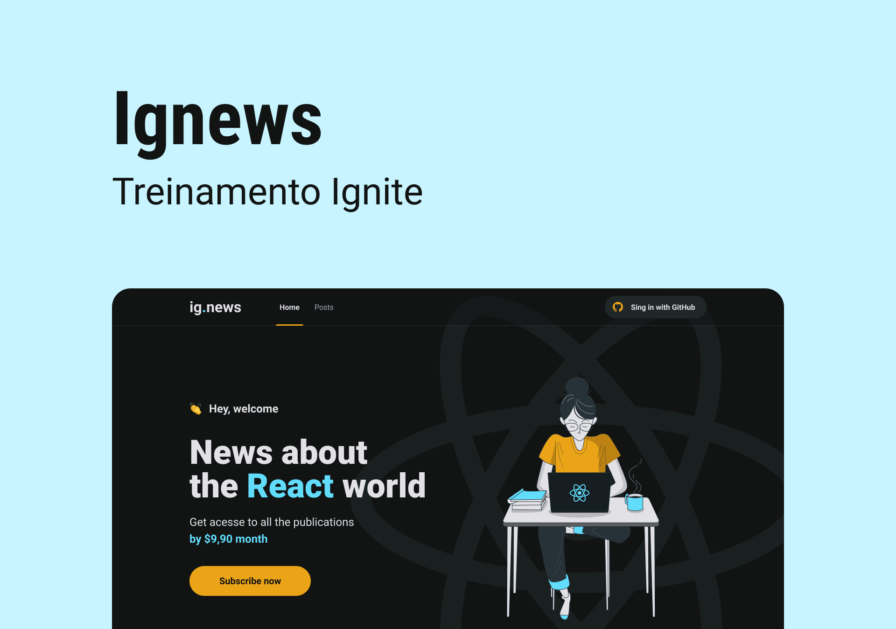

# Ignews

Demo: https://capelaum-ignews.vercel.app

## Description

Posts or News subscription service application, made only as simulation and educational purposes.

Features include social login with Github, Prismic CMS to manage posts, Stripe as payment method and Fauna DB to store users and subscriptions data.

It enables a not subscribed user to view only the initial content of the posts, while subscribed users can view the hole post.

Developed during the Ignite program - React trail

## Layout

You can check out the [layout][figma] in figma.

## Executing

Create your `.env.local` file following the `.env.example` example.

Clone this repository, install dependencies with `yarn` or `npm install` and run locally with `yarn dev` command in the terminal.

## Tech

- [Next.js][next]
- [Sass][sass]
- [Next Auth][next_auth]
- [Stripe][stripe]
- [Prismic CMS][prismic]
- [Fauna DB][fauna_db]

[next]: https://nextjs.org
[sass]: https://sass-lang.coms
[next_auth]: https://next-auth.js.org
[stripe]: https://stripe.com
[prismic]: https://prismic.io
[fauna_db]: https://fauna.com
[figma]: https://www.figma.com/file/iuxD2iS1mIelTiV8sdLbG4/ig.news-(Copy)?node-id=1%3A2

## Credits

🚀 [Rocketseat](https://www.rocketseat.com.br)

ignews-zeta-eight.vercel.app
